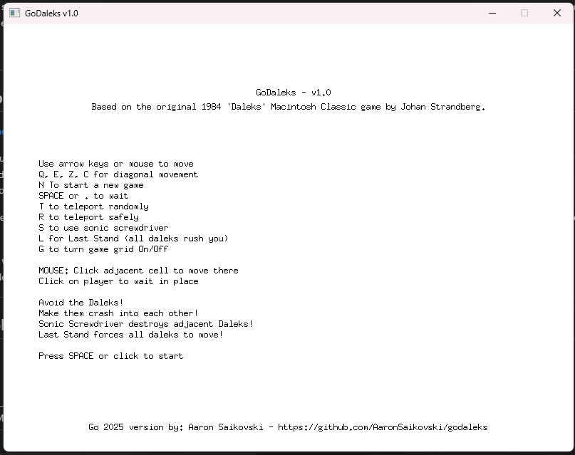
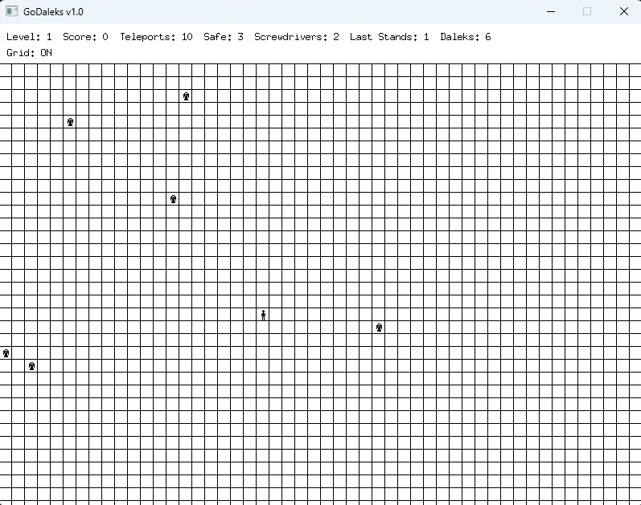

<div align="center">

# GoDaleks v1.2.2 

A modern Go/Ebiten (and faithful) recreation of the classic Apple Macintosh game **Daleks**, itself inspired by Johan Strandberg’s 1984 _Daleks_ and the older BSD UNIX game _Robots_.  
This version keeps the spirit of the original while adding smooth animations, mouse support, and modern gameplay tweaks including sounds.

[](https://github.com/AaronSaikovski/godaleks/actions)

[](LICENSE)

</div>

## 📜 Background

The version you see here is a modern port designed to run cross-platform on today’s systems, preserving the tension and strategy that made the original game so addictive.
All efforts have been made to make this game as faithful to the original as possible.

This code is written in Go and can be played locally or on the web via a Web assembly compiled version and is fully self contained.

See [here](https://www.macintoshrepository.org/3913-daleks)

---

## 🎮 Gameplay

[GoDaleks- Online Playable version](https://www.godaleks.com)

In this game, you attempt to survive by avoiding steadily converging robots If you are overrun by the robots, or move into their immediate zone of control, you are disintegrated.
By guiding the robots with your actions, you can get them to destroy themselves as they collide with each other.
You can escape by teleporting out of range, or you can destroy adjacent robots once each round with a sonic screwdriver.





Daleks move one step per turn toward you. Survive by making them crash into each other, creating scrap heaps, or by destroying them with your **Sonic Screwdriver**.

**You win a level** when all Daleks are destroyed.  
**You lose** if a Dalek catches you.

---

## 🕹️ Controls

### **Keyboard**

| Key                | Action                                          |
| ------------------ | ----------------------------------------------- |
| Arrow Keys / Mouse | Move up, down, left, right and down             |
| Q / E / Z / C      | Diagonal movement                               |
| `SPACE` or `.`     | Wait in place                                   |
| `T`                | Teleport randomly                               |
| `N`                | Start a New game                                |
| `R`                | Safe teleport (avoid near Daleks)               |
| `S`                | Use Sonic Screwdriver (destroy adjacent Daleks) |
| `L`                | Last Stand (Daleks rush continuously)           |
| `G`                | Toggle grid on/off                              |
| `D`                | Debug info (speed, daleks left, etc.)           |

### **Mouse**

- **Click adjacent cell**: Move there
- **Click on your position**: Wait in place

---

## 🛠 Features

### Core Gameplay
- Smooth Dalek movement with easing animations
- Cool sound effects and audio feedback
- Mouse and keyboard control support
- Scrap heaps from Dalek-to-Dalek collisions
- Optional grid overlay for strategic positioning
- Level progression with increasing difficulty

### Power-ups & Tools
- **Teleports** (normal random & safe guaranteed)
- **Sonic Screwdriver** (destroy adjacent Daleks)
- **Last Stands** (bonus mode - continuous Dalek rush)

### Visual Effects
- Teleportation effects with visual feedback
- Sonic Screwdriver visual effects
- Collision explosion animations
- Smooth interpolated movement between grid cells

### Boss Mechanics (v1.2.0+)
- **Dalek Emperor**: Invulnerable boss character
  - Spawns on level 2+ with 60% chance
  - Crushes regular Daleks on collision
  - Provides strategic challenge as two-phase battle
  - Becomes vulnerable only when all normal Daleks defeated
  - **50 point bonus** for defeating the Emperor

---

## 📈 Scoring

| Action | Points |
|--------|--------|
| Dalek destroyed by collision | +2 |
| Dalek destroyed by Sonic Screwdriver | +5 |
| Regular Dalek crushed by Emperor | +2 |
| **Dalek Emperor defeated** | **+50** |
| Level completion bonus | +10 × level number |
| Last Stand completion bonus | +50 |

---

## 🚀 Building & Running

### Prerequisites

- **Go 1.26.5+** (the `go` directive pins `1.26.5`, which carries the patched `crypto/tls` — see [GO-2026-5856](https://pkg.go.dev/vuln/GO-2026-5856))
- [Taskfile](https://taskfile.dev/) (task runner)
- **Linux only**: X11/ALSA dev libraries — `sudo apt install libasound2-dev libx11-dev libxrandr-dev libxcursor-dev libxinerama-dev libxi-dev libgl-dev libxxf86vm-dev`
- **Windows/macOS**: No additional system dependencies (Ebitengine uses [purego](https://github.com/ebitengine/purego))

#### Optional developer tooling

`task staticcheck` and `task seccheck` rely on tools that ship separately from Go. Install them and make sure `$(go env GOPATH)/bin` is on your `PATH`:

```bash
go install honnef.co/go/tools/cmd/staticcheck@latest   # task staticcheck
go install golang.org/x/vuln/cmd/govulncheck@latest     # task seccheck
```

### Task Commands

All commands are managed via `Taskfile.yml`:

```bash
task build            # Debug build → bin/godaleks.exe
task run              # Build and run (go run ./main.go)
task release          # Optimized build (-ldflags="-s -w")
task lint             # go fmt ./... && go mod tidy
task vet              # go vet ./...
task test             # go test -v ./...
task deps             # go mod tidy + download + update
task clean            # Remove bin/ and dist/
task staticcheck      # staticcheck ./...
task seccheck         # govulncheck ./...
task goreleaser       # goreleaser release --snapshot --clean
task generate         # go generate ./main.go
task wasm:build       # Build WASM bundle into ./web
task wasm:serve       # Serve ./web on http://127.0.0.1:8080
task wasm             # wasm:build + wasm:serve
```

### WebAssembly Build

Build and serve the WASM bundle locally in one step:

```bash
task wasm
```

Under the hood this runs:

- `task wasm:build` — compiles `./main.go` with `GOOS=js GOARCH=wasm` using the release flag set below and copies `index.html` + `wasm_exec.js` into `./web/`.
- `task wasm:serve` — starts the dev server in `scripts/serve/` on `http://127.0.0.1:8080`, serving `./web/` with the correct `application/wasm` MIME type and `Cache-Control: no-store` so rebuilds reload cleanly.

#### Release flags

The WASM bundle deployed to GitHub Pages (and produced by `task wasm:build` locally) is built with:

| Flag | Purpose |
|------|---------|
| `-ldflags="-s -w"` | Strip symbol table (`-s`) and DWARF debug info (`-w`) |
| `-trimpath` | Remove local filesystem paths from the binary (reproducible) |
| `-buildvcs=false` | Omit embedded VCS stamps (deterministic output) |

The CI pipeline (`.github/workflows/deploy-wasm.yml`) additionally runs `wasm-opt -O4 --strip-debug --strip-producers` from [binaryen](https://github.com/WebAssembly/binaryen) after the Go build, which typically reduces the WASM binary by a further 15-25%. `wasm-opt` is not required for local builds.

Equivalent manual command:

```bash
GOOS=js GOARCH=wasm go build -ldflags="-s -w" -trimpath -buildvcs=false -o godaleks.wasm ./main.go
```

All game assets (images, sounds) are embedded via `//go:embed` — the `.wasm` binary is fully self-contained. Serve `index.html`, `wasm_exec.js`, and `godaleks.wasm` together.

### Testing

```bash
task test
```

Runs `go test -v ./...`. Current coverage:

- `cmd/` — unit tests for core game logic: `abs`, `checkCollisionWithThreshold`, `distance` (squared-distance contract), `rebuildScrapGrid` / `rebuildOccupancyGrid` (including bounds guards and stale-entry clearing), `isScrapAt` boundary checks, the trig-lookup-table invariants (`trigTableSize` must be a power of two, table contents anchored to known points), and the Last Stand acceleration linear-approximation tolerance.
- `scripts/serve/` — unit tests for the local WASM dev server (directory resolution, MIME-type handling, cache headers, path-traversal protection).

### Releasing

Releases are triggered by pushing a version tag:

```bash
git tag v1.2.2
git push origin v1.2.2
```

This builds binaries for **Linux** (amd64), **Windows** (amd64), and **macOS** (amd64/arm64) via GitHub Actions. The WASM version is automatically deployed to GitHub Pages on every push to `main`.

## 📋 Game Mechanics

### Level Progression
- **Starting Daleks**: 5 + current level count
- **Difficulty**: Increases with each level
- **Resources per level**:
  - +2 Teleports per level
  - +2 Sonic Screwdrivers per level
  - +1 Last Stand every 5 levels
- **Level completion**: All Daleks must be destroyed

### Dalek Behavior
- **Normal Movement**: Move one grid cell per turn toward the player
- **Animation**: 0.7 second smooth easing animation per move
- **Collision Detection**: Grid-based (50×33 grid, 16 pixels per cell)
- **Collision Rules**:
  - Dalek hits scrap: Dies (+2 points)
  - Dalek hits Dalek: Both die (+2 points each), scrap created
  - Dalek hits Emperor: Dies (+2 points), Emperor survives
  - Emperor hits nothing: Survives until all normal Daleks defeated

### Emperor Mechanics (v1.2.0+)
- **Spawn Conditions**: Level 2+, 60% chance per level
- **Spawn Distance**: At least 3 cells from player
- **Visual**: Unique sprite (red emperor Dalek)
- **Audio**: "dalek_emperor" alert sound on spawn + visual warning
- **Invulnerability**: Cannot be harmed while normal Daleks exist
- **Combat**: Crushes any normal Dalek on collision
- **Defeat**: Dies when all normal Daleks eliminated (+50 bonus points)
- **Scrap Immunity**: Cannot be destroyed by scrap heaps

### Last Stand Mode
- **Activation**: Press `L` key (requires available Last Stand)
- **Behavior**: Daleks accelerate continuously toward player
- **Initial Speed**: 2.0 cells/second
- **Acceleration**: 1.1× per second
- **Maximum Speed**: 8.0 cells/second
- **End Condition**: All Daleks destroyed or player caught
- **Bonus**: +50 points on successful completion

---

## 📝 Changelog

### v1.2.2 - Direction Arrows, Rendering, Hot-Path Optimisation & Security Patch
- **Added**: Classic 8-direction arrows around the human player — bold black arrows drawn only for valid moves (in-bounds and not blocked by scrap). They hide while the Daleks move and reappear around the player's new position each turn, matching the original
- **Removed**: The green highlight square over the player's own cell on mouse hover; the mouse indicator now only highlights adjacent move cells (blue = valid, red = blocked)
- **Improved**: The scrap grid now rebuilds only when scraps actually change (dirty flag + `ensureScrapGrid`) instead of on every `isScrapAt` call, so the new per-frame arrow overlay reads it with O(1) lookups and no per-frame rebuild or allocation — keeping to the project's zero-per-frame-GC design. Backed by dirty-flag unit tests
- **Fixed**: Jerky Dalek movement — `Update` derived `deltaTime` from the wall clock, but Ebiten runs `Update` at a fixed tick rate and fires catch-up ticks back-to-back, producing uneven time steps that made the interpolated motion stutter. Now uses a fixed timestep (`1/TPS`) for perfectly even, smootherstep-eased animation progress
- **Security**: Bumped `go` directive to `1.26.5` to pull the patched `crypto/tls` standard library (resolves `GO-2026-5856`)
- **Cleaned**: Removed the unused `lastUpdateTime` field, merged a redundant `var`/assignment in `movement.go` (S1021), and dropped a dead `countNormalDaleks()` call in `collision.go` (SA4006)
- **Added**: WASM deploy pipeline now runs `go test ./...` before building and `wasm-opt -O4 --strip-debug --strip-producers` (binaryen) after building — typical 15-25% binary size reduction on top of Go's release flags
- **Added**: `-buildvcs=false` to both local (`task wasm:build`) and CI WASM builds for deterministic, reproducible output
- **Improved**: Particle effects (teleport, sonic screwdriver, collision explosion, shockwave) now index into the pre-computed 32-entry sin/cos lookup table instead of calling `math.Cos`/`math.Sin` per frame
- **Improved**: `Grid: ON/OFF` HUD string is cached and refreshed only on toggle (was allocated every frame)
- **Improved**: "Level N Complete!" / "Starting Level N..." strings are cached at state entry instead of `fmt.Sprintf`'d every frame during the 1.5s transition
- **Improved**: Last Stand acceleration uses a linear approximation in place of `math.Pow(accel, deltaTime)` — rounding-accurate at 60 FPS, one less transcendental per frame
- **Improved**: Last Stand dalek-vs-scrap collision uses the existing `scrapGrid [50][33]bool` for O(1) lookup instead of O(n×m) dalek×scrap iteration
- **Added**: Unit tests for `cmd/` core game logic (`abs`, collision threshold, distance contract, grid rebuilds, trig table invariants, Last Stand acceleration approximation)
- **Added**: `task wasm:build`, `task wasm:serve`, `task wasm` — local WASM build-and-serve workflow with `scripts/serve/` static file server (correct `application/wasm` MIME, `Cache-Control: no-store`, path-traversal guard)
- **Fixed**: `task test` now runs `./...` instead of non-existent `./test/...`
- **Removed**: Debug `fmt.Printf` from `KeyD` handler (leftover from Last Stand development)

### v1.2.1 - Performance & Quality Update
- **Added**: Multi-platform release builds (Linux, Windows, macOS amd64/arm64) via GitHub Actions
- **Added**: WASM deployment to GitHub Pages on every push to main
- **Added**: 1.5 second level transition delay with "Level Complete" overlay
- **Added**: CI linting (go vet, go fmt) in all workflows
- **Fixed**: Collision sound sometimes not playing due to single-instance audio player conflicts
- **Improved**: Sound system creates fresh audio players per playback, allowing overlapping sounds
- **Improved**: Zero-allocation collision detection using reusable pre-allocated buffers
- **Improved**: Grid-based O(1) occupancy and scrap lookups replacing O(n) linear scans
- **Improved**: Pre-computed trig lookup tables, cached HUD strings, in-place slice filtering
- **Improved**: Optimised WASM binary with `-ldflags="-s -w" -trimpath`

### v1.2.0 - Emperor Update
- **Added**: Dalek Emperor boss character (invulnerable until normal Daleks defeated)
- **Added**: Emperor collision mechanics - crushes regular Daleks
- **Added**: Emperor visual sprite and audio alert
- **Improved**: Two-phase final boss battle system
- **Added**: 50-point bonus for defeating Emperor
- **Fixed**: Collision logic to allow Emperor to actively engage in combat

### v1.1.0 - Performance Update
- **Improved**: Big performance fixes and optimizations
- **Improved**: Better animations and smooth movement
- **Added**: Enhanced visual effects

### v1.0.0 - Initial Release
- Core game mechanics from classic Daleks
- Smooth animations and modern graphics
- Mouse and keyboard controls
- Sound effects and audio

---

## 🔧 Architecture

All game logic lives in the `cmd` package. `main.go` is the Ebiten bootstrap.

### Core Files

| File | Purpose |
|------|---------|
| `cmd/root.go` | Game loop (`Update`/`Draw`/`Layout`), state machine |
| `cmd/types.go` | Entity definitions (`Dalek`, `Game`, `CollisionEffect`) |
| `cmd/constants.go` | Grid dimensions, game states, pre-computed layout offsets |
| `cmd/collision.go` | Collision detection with emperor invulnerability rules |
| `cmd/movement.go` | Dalek AI movement + smootherstep easing + Last Stand mode |
| `cmd/effect.go` | Player actions (teleport, screwdriver) + particle effects |
| `cmd/draw.go` | Rendering: grid, sprites, HUD, level-complete/game-over overlays |
| `cmd/game.go` | Level management, entity spawning, O(1) grid-based lookups |
| `cmd/input.go` | Mouse click handling and move validation |
| `cmd/menu.go` | Title screen rendering |
| `cmd/loadimages.go` | Embedded PNG sprite loading (`//go:embed assets/*`) |
| `cmd/loadsounds.go` | Embedded WAV audio loading + per-playback player creation |
| `cmd/sprites.go` | Programmatic scrap heap image generation |
| `scripts/serve/main.go` | Local static file server for WASM development (`task wasm:serve`) |

### Key Design Decisions

- **Entity model**: `Dalek` has both `GridPos` (logical) and `VisualPos` (interpolated for smooth animation). `IsEmperor` flag controls boss behavior.
- **State machine**: `StateMenu → StatePlaying → StateLevelComplete (1.5s) → StatePlaying` or `→ StateGameOver/StateWin`.
- **Zero-allocation game loop**: Pre-allocated reusable buffers (`dalekRemoveMap`, `survivingDaleksBuf`, `scrapMap`, etc.) on the `Game` struct eliminate per-frame GC pressure.
- **O(1) spatial lookups**: `occupancyGrid [50][33]bool` and `scrapGrid [50][33]bool` replace map-based position checks.
- **Overlapping audio**: Fresh `audio.Player` created per `Play()` call to support concurrent sounds.

---

## 🐛 Reporting an Issue

Please feel free to lodge an [issue or pull request on GitHub](https://github.com/AaronSaikovski/godaleks/issues).
